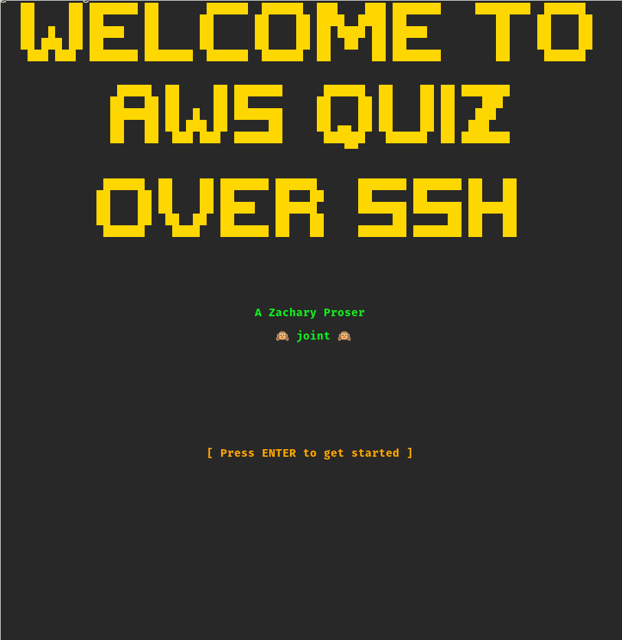
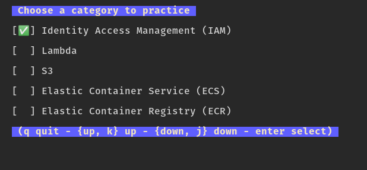
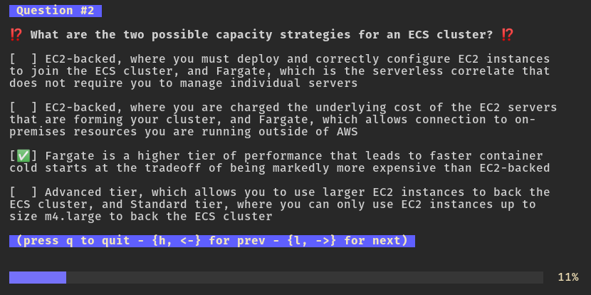
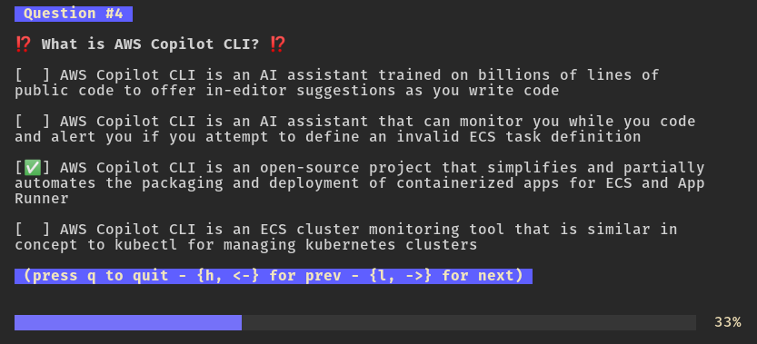
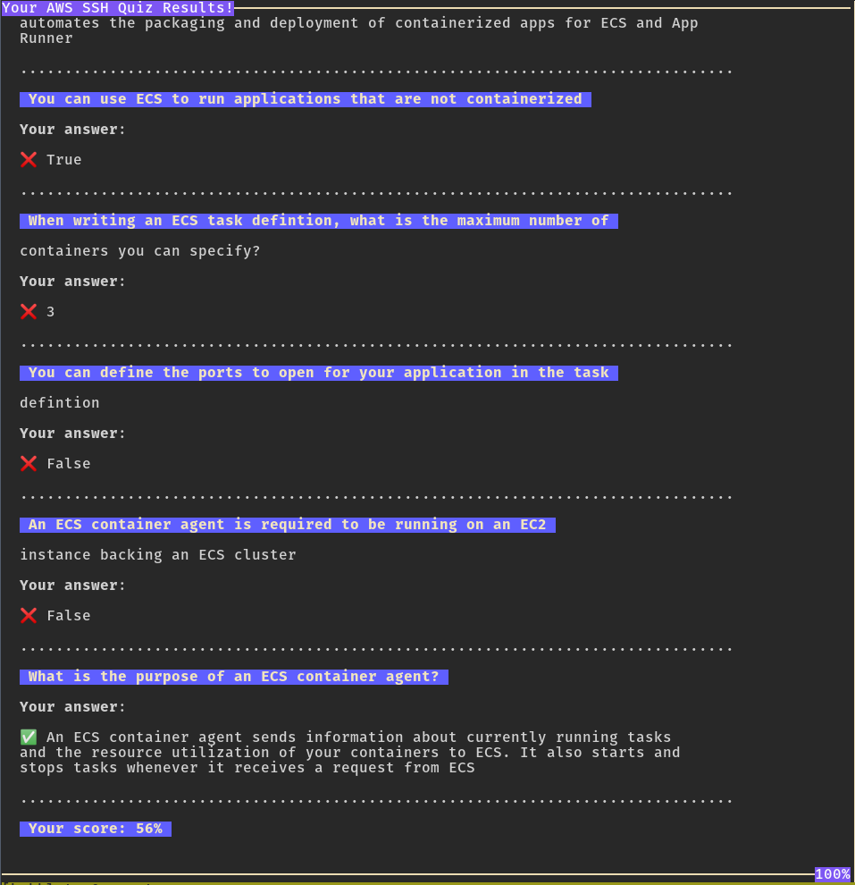

# Tea Tutor 


[](https://goreportcard.com/report/github.com/zackproser/teatutor)
[](https://circleci.com/gh/zackproser/teatutor)

This is a [Bubbletea](https://github.com/charmbracelet/bubbletea) program designed to be run locally or over ssh. You can use it to define and serve quizzes on any subject. 


# Demo

[](http://www.youtube.com/watch?v=Dk2neG9vp84 "Tea Tutor Demo")

Depending on what I'm doing at the time - you may or may not have success hitting my test application: 
`ssh -p 23234 quiz.zackproser.com`. 


# App at a glance

Tea tutor helps you study whatever you want quickly, conveniently and discretely by providing a high quality set of questions and an easy to navigate, slide-deck-like interface that you can load in your terminal with a single command, e.g. `ssh -p 23234 quiz.zackproser.com`.

For the purposes of demonstration and development, the app currently hardcodes a custom set of AWS certification exam prep questions. 



When you first load the program, you are presented with a list of current study tracks to choose from. 



Choose a study topic to begin.



You'll be asked a series of multiple choice and true or false questions that test your AWS product knowledge. You can page back and forth between questions and change your answers as needed. 



When you complete your quiz, you'll be shown the results page that reviews the questions you answered, your responses and whether they were correct. 




# Usage 

## How the current questions system works

All questions are defined in the `questions.yml` file in the root of the project. Each of the categories defined in `questions.yml` is considered when rendering the category selection view that is shown immediately after the introduction view. In other words, if you create questions across 3 different categories, by filling in the `category:` field, then you'll see 3 categories in the picker when the app loads. 

Therefore, you could edit `questions.yml` to contain questions and answers on any subject you wish, then re-deploy your app to serve the new questions.

## Run locally 

`go run main.go` 

## Run in server mode (to host over ssh)
```bash 
# export the special env var to enable server mode 
export QUIZ_SERVER=true 
go run main.go
```

Currently I've had the most success deploying the app via `tmux` - running `export QUIZ_SERVER=true && go run main.go` in a new tmux session on the server and then detaching from it. 
I expect this to change once I'm able to sort out some issues using Systemd unit files. 

## Connect to server as a client 

`ssh -p 23234 <ip-address-of-server>`

There is no auth required - all ssh public keys are accepted. 
